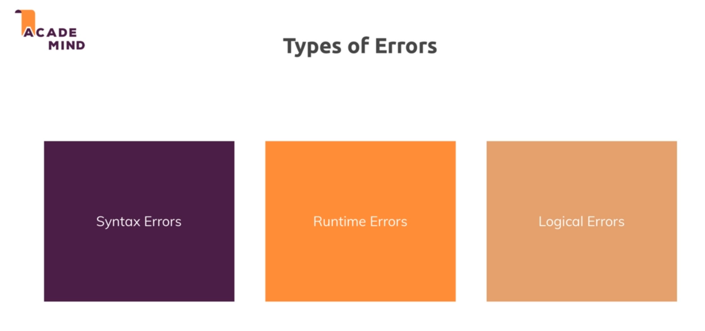
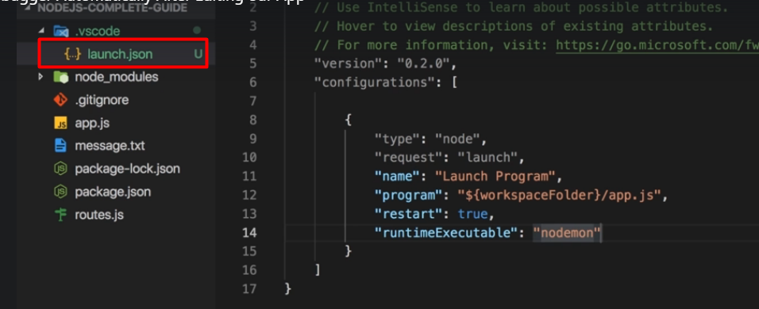

# Debugging

## Run a custom script

> "start-custom": "node app.js"

To run:

```sh
npm run start-custom
```

## Node Packages

> Auto reload the project

```sh
# for development only, not includes in Prod:
npm install nodemon --save-dev
```

## Global Features vs Core Modules vs Third-Party Modules

The last lectures contained important concepts about available Node.js features and how to unlock them.
You can basically differentiate between:

<span style="color:#44c664">

**Global features:** Keywords like const or function but also some global objects like process

**Core Node.js Modules:** Examples would be the file-system module ("fs"), the path module ("path") or the Http module ("http")

**Third-party Modules:** Installed via npm install - you can add any kind of feature to your app via this way

</span>

Global features are always available, you don't need to import them into the files where you want to use them.

Core Node.js Modules don't need to be installed (NO npm install is required) but you need to import them when you want to use features exposed by them.

Example:

> const fs = require('fs');

You can now use the fs object exported by the "fs" module.

Third-party Modules need to be installed (via npm install in the project folder) AND imported.

Example (which you don't need to understand yet - we'll cover this later in the course):

```
// In terminal/ command prompt
npm install --save express-session
// In code file (e.g. app.js)
const sessions = require('express-session');
```

## Types of Errors



## Restart Debugging



## Useful Resources & Links

Attached, you find the source code for this section.

When using my source code, make sure to run npm install in the extracted folder!

Useful resources:

More on debugging Node.js: _https://nodejs.org/en/docs/guides/debugging-getting-started/_

Debugging Node in Visual Studio Code: _https://code.visualstudio.com/docs/nodejs/nodejs-debugging_
