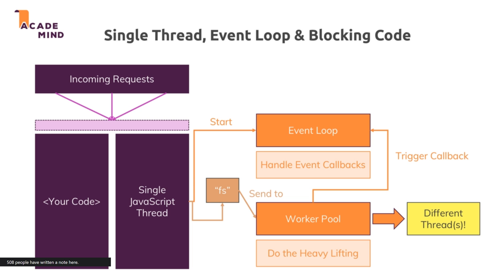

# Node.JS Basic

## Event Loop

## Request & Response Headers

> On both requests and responses, Http headers are added to transport metadata from A to B.

The following article provides a great overview of available headers and their role: https://developer.mozilla.org/en-US/docs/Web/HTTP/Headers

Whilst this article is a great resource, especially to dive deeper, please don't learn this list by heart though! You'll encounter many of these headers throughout the course and I'll explain them when we need them.

## Raw Request - Stream and Buffers (behind the scene)

## Behind the Scenes

### Incoming requests

### The Event Loop

## Useful Resources & Links

Useful resources:

- Official Node.js Docs: https://nodejs.org/en/docs/guides/
- Full Node.js Reference (for all core modules): https://nodejs.org/dist/latest/docs/api/
- More about the Node.js Event Loop: https://nodejs.org/en/docs/guides/event-loop-timers-and-nexttick/
- Blocking and Non-Blocking Code: https://nodejs.org/en/docs/guides/dont-block-the-event-loop/
